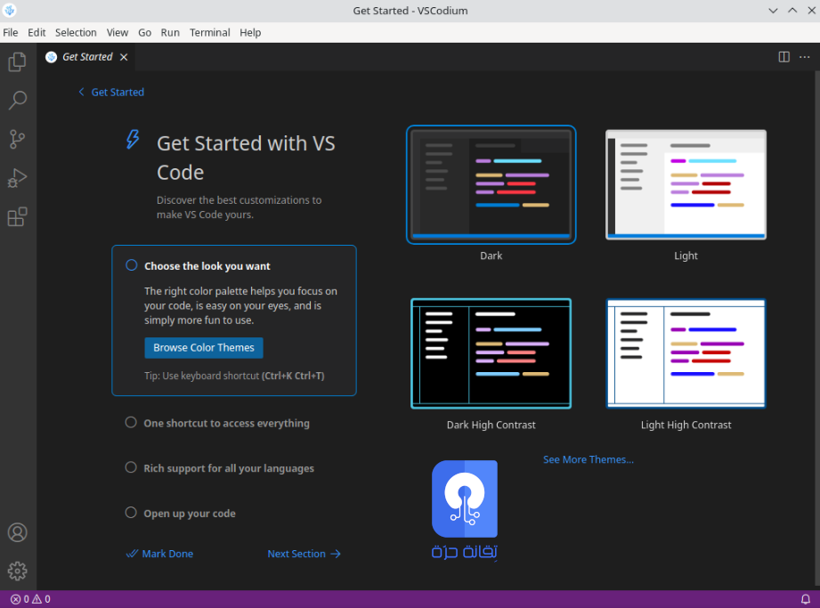

في حال كنت مبرمجا أو مهتما بالتطوير وتُفضل الحلول المفتوحة المصدر ، اسمح لي أن أقدم لك محرر الأكواد vscodium الحر المصدر والذي يأتي دون أكواد تتبع ويقدم لك ميزات ودعم مجتمعي كبير ، إضافة إلى أنه متوفر لأنظمة التشغيل المعروفة والتي يأتي في مقدمتها لينكس بالطبع.

في موضوع اليوم سنُغطي كيفية تثبيت محرر الأكواد vscodium على توزيعات لينكس الشائعة.

## بما يختلف VSCodium عن VSCode

نسخة vscodium حرة المصدر بالكامل بمعنى أنها تحتوي فقط على الكود المفتوح المصدر وتأتي دون تتبع، أما نسخة vscode فهي ليست مفتوحة المصدر بالكامل وتأتي مع أكواد تتبع من مايكروسوفت.

يعني أن محرر الأكواد هذا يُعطيك حزمة جاهزة للتثبيت والاستخدام على نظامك دون إضافات مغلقة أو أكواد تتبع ويمكن تحديثه بسهولة.

## طريقة التثبيت على التوزيعات الديبيانية

**ماذا ستحتاج لتطبيق هذا الشرح؟**

- استخدام الطرفية (سطر الأوامر)
- اتصال بالانترنت
- قليل من التركيز فقط

لتطبيق الأوامر ستقوم بفتح الطرفية من قائمة التطبيقات أو من خلال الضغط مرة واحدة على **Ctrl + Alt + T** من لوحة المفاتيح.

بالنسبة إلى دبيان أو إذا كنت تستخدم أوبونتو أو التوزيعات المبنية عليها مثل لينكس منت، فيمكنك تطبيق الأوامر التالية في الطرفية.

الخطوة الأولى هي إضافة مفتاح GPG.

قم بنسخ الأمر التالي كما هو دون زيادة أو نقصان.

اضغط مرتين لنسخ الكود.

```shell
wget -qO - https://gitlab.com/paulcarroty/vscodium-deb-rpm-repo/raw/master/pub.gpg \     | gpg --dearmor \     | sudo dd of=/usr/share/keyrings/vscodium-archive-keyring.gpg
```

الخطوة الثانية هي إضافة المستودع من خلال هذا الأمر.

```shell
echo 'deb [ signed-by=/usr/share/keyrings/vscodium-archive-keyring.gpg ] https://download.vscodium.com/debs vscodium main' \     | sudo tee /etc/apt/sources.list.d/vscodium.list
```

الخطوة الثالثة هي تحديث النظام.

```shell
sudo apt update
```

بعد تنفيذك للخطوات السابقة ستقوم بتثبيت الحُزمة بتطبيق الأمر التالي في الطرفية.

```shell
sudo apt install codium
```

## طريقة التثبيت على التوزيعات المبنية على ريد هات

بالنسبة إلى التوزيعات الريدهاتية الشهيرة مثل [Fedora](https://librar.net/fedora-37-released/) أو Rocky Linux يمكن تطبيق الأوامر التالية في الطرفية.

أولا: إضافة مفتاح GPG.

```shell
sudo rpmkeys --import https://gitlab.com/paulcarroty/vscodium-deb-rpm-repo/-/raw/master/pub.gpg
```

ثانيا: إضافة المستودع.

```shell
printf "[gitlab.com_paulcarroty_vscodium_repo]\nname=download.vscodium.com\nbaseurl=https://download.vscodium.com/rpms/\nenabled=1\ngpgcheck=1\nrepo_gpgcheck=1\ngpgkey=https://gitlab.com/paulcarroty/vscodium-deb-rpm-repo/-/raw/master/pub.gpg\nmetadata_expire=1h" | sudo tee -a /etc/yum.repos.d/vscodium.repo
```

بعد ذلك يُفضل تحديث التوزيعة.

```shell
sudo dnf update
```

الخطوة الأخيرة هي التثبيت من خلال الأمر التالي.

```shell
sudo dnf install codium
```

## طريقة التثبيت على توزيعات لينكس الأخرى

فيما يلي خطوات التثبيت.

### توزيعة OpenSUSE

يكفي فقط تطبيق الأوامر التالية بالترتيب.

بخصوص إضافة مفتاح GPG استخدم نفس الأمر السابق الخاص بتوزيعة Fedora و Rocky Linux.

لإضافة المستودع طبق الأمر التالي.

اضغط مرتين لنسخ الكود.

```shell
printf "[gitlab.com_paulcarroty_vscodium_repo]\nname=gitlab.com_paulcarroty_vscodium_repo\nbaseurl=https://download.vscodium.com/rpms/\nenabled=1\ngpgcheck=1\nrepo_gpgcheck=1\ngpgkey=https://gitlab.com/paulcarroty/vscodium-deb-rpm-repo/-/raw/master/pub.gpg\nmetadata_expire=1h" | sudo tee -a /etc/zypp/repos.d/vscodium.repo 
```

لتثبيت الحزمة استخدم هذا الأمر.

```shell
sudo zypper in codium
```

### توزيعة Arch

بخصوص Arch طريقة التثبيت تكون من خلال المستودع الغير الرسمي AUR بتطبيق الأمر التالي في الطرفية.

```shell
sudo aura -A vscodium-bin
```

يُفضل أن تكون أكثر حذرا عند تثبيت أي حزمة من خلال هذا المستودع.

### توزيعة NixOS

الحُزمة متوفرة في المستودع الرسمي لهذه التوزيعة ويمكن تثبيتها من خلال هذا الأمر.

```shell
nix-env -iA nixpkgs.vscodium
```

## طريقة التثبيت عن طريق Flatpak

في حال كانت توزيعتك تدعم فلات باك وقمت مسبقا بتفعيل مستودع flathub، طريقة التثبيت تكون باستخدام الأمر التالي.

```shell
flatpak install flathub com.vscodium.codium
```

تكلمت سابقا عن تحزيم فلاتباك في المقالات التالية:



وأيضا هذا المقال



## واجهة محرر الأكواد VSCodium

عندما تُكمل خطوات التثبيت بنجاح، تستطيع تشغيل هذه البرمجية من قائمة التطبيقات في توزيعتك وستظهر لك الواجهة التالية.



بعد أن تختار أحد الثيمات، خذ راحتك في استكشاف الإعدادات الخاصة بمحرر الأكواد vscodium. 

أو يمكنك أن تطلع على التوثيق الخاص به من خلال [موقعه الرسمي](https://vscodium.com/).

وأيضا عبر صفحته الرسمية



كان هذا مقال قدمنا فيه لمحة بسيطة عن برمجية حرة لتحرير الأكواد مفتوحة المصدر بالكامل وكيفية تثبيتها على مختلف توزيعات لينكس.
